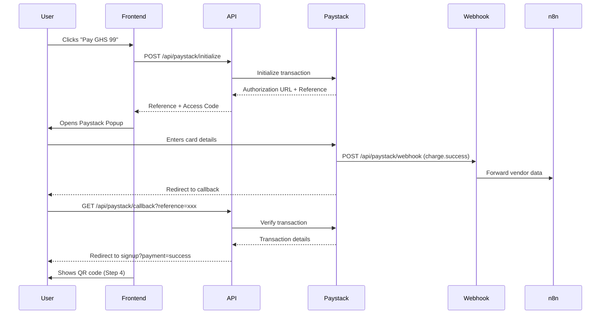

# Paystack Integration Setup Guide

This guide covers the complete setup of Paystack payment processing for the Beeline platform.

## Overview

The Paystack integration handles:
- One-time payment of GHS 99 for 7-day trial
- Payment verification and confirmation
- Webhook events for payment tracking
- Integration with n8n for vendor onboarding

## Architecture

```
User completes signup → Paystack Popup → Payment → Webhook → n8n → WhatsApp QR Code
```

### Components Created:

1. **API Routes** (`website/app/api/paystack/`)
   - `initialize/route.ts` - Initialize payment and get authorization URL
   - `verify/route.ts` - Verify payment after completion
   - `webhook/route.ts` - Handle Paystack webhook events
   - `callback/route.ts` - Handle user redirect after payment

2. **Utility Library** (`website/lib/paystack.ts`)
   - Payment initialization helpers
   - Paystack popup integration
   - Payment verification functions

3. **Updated Signup Page** (`website/app/signup/page.tsx`)
   - Email field added
   - Payment flow integrated
   - Error handling and loading states

## Setup Instructions

### 1. Get Paystack API Keys

1. Sign up at [https://paystack.com](https://paystack.com)
2. Complete business verification (required for Ghana)
3. Navigate to **Settings → API Keys & Webhooks**
4. Copy your keys:
   - **Public Key** (starts with `pk_test_` or `pk_live_`)
   - **Secret Key** (starts with `sk_test_` or `sk_live_`)

### 2. Configure Environment Variables

Create `.env.local` in the `website/` directory (copy from `.env.example`):

```bash
# Paystack Configuration
NEXT_PUBLIC_PAYSTACK_PUBLIC_KEY=pk_test_your_public_key_here
PAYSTACK_SECRET_KEY=sk_test_your_secret_key_here
PAYSTACK_WEBHOOK_SECRET=your_webhook_secret_here

# Existing variables
NEXT_PUBLIC_API_URL=http://localhost:3000/api
NEXT_PUBLIC_N8N_WEBHOOK_URL=https://n8n-latest-4dbq.onrender.com/webhook/vendor-onboard
NEXT_PUBLIC_SITE_URL=https://beeline.works
```

**Important Notes:**
- `NEXT_PUBLIC_*` variables are exposed to the browser
- `PAYSTACK_SECRET_KEY` is server-side only (never expose to browser)
- Use test keys for development, live keys for production

### 3. Set Up Paystack Webhook

1. Go to **Settings → API Keys & Webhooks** in Paystack dashboard
2. Click **Add Webhook URL**
3. Enter: `https://beeline.works/api/paystack/webhook`
4. Copy the **Webhook Secret** and add to `.env.local`
5. Select events to listen for:
   - ✅ `charge.success` - Payment completed
   - ✅ `subscription.create` - Subscription created (future use)
   - ✅ `subscription.disable` - Subscription cancelled
   - ✅ `invoice.create` - Recurring payment
   - ✅ `invoice.update` - Invoice status change

### 4. Install Dependencies

```bash
cd website
npm install
```

This will install the `crypto` package needed for webhook signature verification.

### 5. Deploy to Vercel

```bash
# Add environment variables to Vercel
vercel env add NEXT_PUBLIC_PAYSTACK_PUBLIC_KEY
vercel env add PAYSTACK_SECRET_KEY
vercel env add PAYSTACK_WEBHOOK_SECRET

# Deploy
git add .
git commit -m "Add Paystack payment integration"
git push
```

Or configure via Vercel Dashboard:
1. Go to Project → Settings → Environment Variables
2. Add each variable for Production, Preview, and Development

## Payment Flow

### User Journey:

1. **Step 1-3:** User fills signup form (name, phone, email, business type, personality)
2. **Step 3 Submit:** User clicks "Pay GHS 99 & Continue"
3. **Paystack Popup:** Opens with payment form
4. **Payment:** User enters card details and pays
5. **Verification:** System verifies payment with Paystack API
6. **Step 4:** Shows WhatsApp QR code for connection

### Technical Flow:



## Testing

### Test Mode Setup:

1. Use test API keys (start with `pk_test_` and `sk_test_`)
2. Use Paystack test cards:
   - **Success:** `5060666666666666666` (CVV: 123, Expiry: any future date)
   - **Declined:** `506066666666666666` (one less 6)
   - **PIN Required:** Use any 4-digit PIN when prompted

### Testing Checklist:

- [ ] User can see payment button on step 3
- [ ] Paystack popup opens when clicking "Pay GHS 99"
- [ ] Test card payment succeeds
- [ ] Payment verification works
- [ ] QR code shows after successful payment
- [ ] Payment reference appears on QR code page
- [ ] Webhook receives `charge.success` event
- [ ] n8n receives vendor onboarding data
- [ ] Payment error handling works (try declined card)
- [ ] User can go back and retry payment

### Manual Testing:

```bash
# 1. Start development server
cd website
npm run dev

# 2. Navigate to signup page
open http://localhost:3000/signup

# 3. Fill form and test payment with test card
# Card: 5060666666666666666
# CVV: 123
# Expiry: 12/25
# PIN: 1234

# 4. Check console for logs
# - Payment initialization
# - Popup opened
# - Payment success
# - Verification response

# 5. Check webhook endpoint (use ngrok for local testing)
ngrok http 3000
# Update webhook URL in Paystack dashboard to ngrok URL
```

### Webhook Testing:

```bash
# Test webhook signature verification
curl -X POST http://localhost:3000/api/paystack/webhook \
  -H "Content-Type: application/json" \
  -H "x-paystack-signature: test_signature" \
  -d '{
    "event": "charge.success",
    "data": {
      "reference": "test_ref_123",
      "amount": 9900,
      "currency": "GHS",
      "customer": {
        "email": "test@example.com",
        "customer_code": "CUS_test123"
      },
      "metadata": {
        "name": "Test User",
        "phone": "+233241234567",
        "businessType": "supermarket",
        "personality": "casual"
      },
      "paid_at": "2025-12-04T10:00:00Z"
    }
  }'
```

## API Endpoints

### Initialize Payment

**POST** `/api/paystack/initialize`

Request:
```json
{
  "email": "kwame@example.com",
  "amount": 99,
  "metadata": {
    "name": "Kwame Mensah",
    "phone": "+233241234567",
    "businessType": "supermarket",
    "personality": "casual",
    "referrerId": "vendor123"
  }
}
```

Response:
```json
{
  "status": true,
  "message": "Authorization URL created",
  "data": {
    "authorization_url": "https://checkout.paystack.com/xxx",
    "access_code": "xxx",
    "reference": "ref_xxx"
  }
}
```

### Verify Payment

**GET** `/api/paystack/verify?reference=ref_xxx`

Response:
```json
{
  "status": true,
  "message": "Payment verified successfully",
  "data": {
    "reference": "ref_xxx",
    "amount": 99,
    "currency": "GHS",
    "customer": {
      "email": "kwame@example.com",
      "customer_code": "CUS_xxx"
    },
    "metadata": { ... },
    "paid_at": "2025-12-04T10:00:00Z",
    "channel": "card"
  }
}
```

### Webhook

**POST** `/api/paystack/webhook`

Receives events from Paystack and forwards to n8n.

Events handled:
- `charge.success` - Payment completed
- `subscription.create` - Subscription created
- `subscription.disable` - Subscription cancelled
- `invoice.create` / `invoice.update` - Recurring payments

## Subscription Management (Future Implementation)

The current implementation handles one-time payments. For recurring subscriptions:

### 1. Create Subscription Plan

```bash
curl -X POST https://api.paystack.co/plan \
  -H "Authorization: Bearer sk_test_xxx" \
  -H "Content-Type: application/json" \
  -d '{
    "name": "Beeline Monthly",
    "interval": "monthly",
    "amount": 9900,
    "currency": "GHS"
  }'
```

### 2. Subscribe Customer

After initial payment, create subscription:

```typescript
// In webhook handler after charge.success
const response = await fetch('https://api.paystack.co/subscription', {
  method: 'POST',
  headers: {
    'Authorization': `Bearer ${process.env.PAYSTACK_SECRET_KEY}`,
    'Content-Type': 'application/json',
  },
  body: JSON.stringify({
    customer: customerCode,
    plan: 'PLN_xxx',
    start_date: new Date(Date.now() + 7 * 24 * 60 * 60 * 1000).toISOString(), // Start after 7-day trial
  }),
});
```

### 3. Handle Recurring Payments

Webhooks will send `invoice.create` and `invoice.update` events for recurring charges. These are already handled in the webhook endpoint.

## Troubleshooting

### Common Issues:

1. **"No signature header" error**
   - Webhook secret not configured
   - Wrong webhook URL in Paystack dashboard
   - Request not from Paystack

2. **"Invalid signature" error**
   - Wrong webhook secret in environment variables
   - Webhook secret mismatch between Paystack and .env

3. **Payment popup not opening**
   - Check console for errors
   - Verify `NEXT_PUBLIC_PAYSTACK_PUBLIC_KEY` is set
   - Ensure Paystack script loaded (check Network tab)

4. **Payment verification fails**
   - Check `PAYSTACK_SECRET_KEY` is correct
   - Verify reference is valid
   - Check API key permissions in Paystack dashboard

5. **n8n not receiving data**
   - Check `NEXT_PUBLIC_N8N_WEBHOOK_URL` is correct
   - Verify n8n webhook is active
   - Check webhook handler logs

## Security Considerations

1. **API Keys:**
   - Never commit API keys to git
   - Use different keys for test/live
   - Rotate keys periodically

2. **Webhook Verification:**
   - Always verify webhook signatures
   - Reject requests without valid signature
   - Log suspicious webhook attempts

3. **Payment Verification:**
   - Always verify payments server-side
   - Don't trust client-side confirmation
   - Check payment amount matches expected value

4. **Environment Variables:**
   - Keep `.env.local` in `.gitignore`
   - Use Vercel's secure environment variable storage
   - Don't expose secret keys to browser

## Monitoring and Analytics

### Metrics to Track:

1. **Payment Success Rate:** % of initiated payments that succeed
2. **Payment Abandonment:** Users who close popup without paying
3. **Payment Errors:** Failed payment attempts
4. **Conversion Rate:** Signups → Payments → Active users
5. **Revenue:** Total payments received

### Logging:

All payment events are logged to console:
- Payment initialization
- Payment success/failure
- Webhook events
- Verification results

For production, send logs to monitoring service (e.g., Sentry, LogRocket).

## Support

### Resources:
- [Paystack Documentation](https://paystack.com/docs)
- [Paystack API Reference](https://paystack.com/docs/api)
- [Paystack Subscriptions Guide](https://paystack.com/docs/payments/subscriptions/)
- [Paystack Test Cards](https://paystack.com/docs/payments/test-payments)

### Contact:
- Paystack Support: support@paystack.com
- Paystack Ghana: +233 (0) 30 254 5464

## Next Steps

1. ✅ Basic payment integration complete
2. ⏳ Set up recurring subscriptions (7-day trial → monthly billing)
3. ⏳ Add subscription management page
4. ⏳ Implement cancellation flow
5. ⏳ Add payment history and invoices
6. ⏳ Set up email notifications for payments
7. ⏳ Add analytics dashboard for revenue tracking
