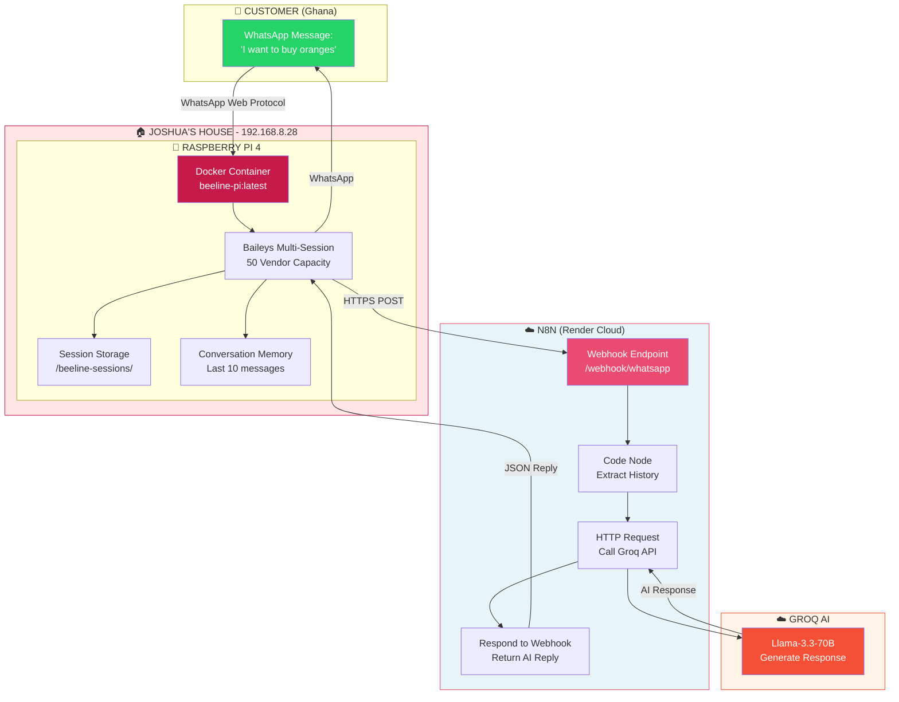
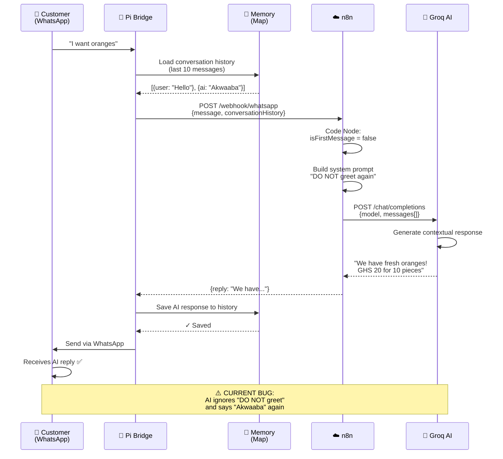
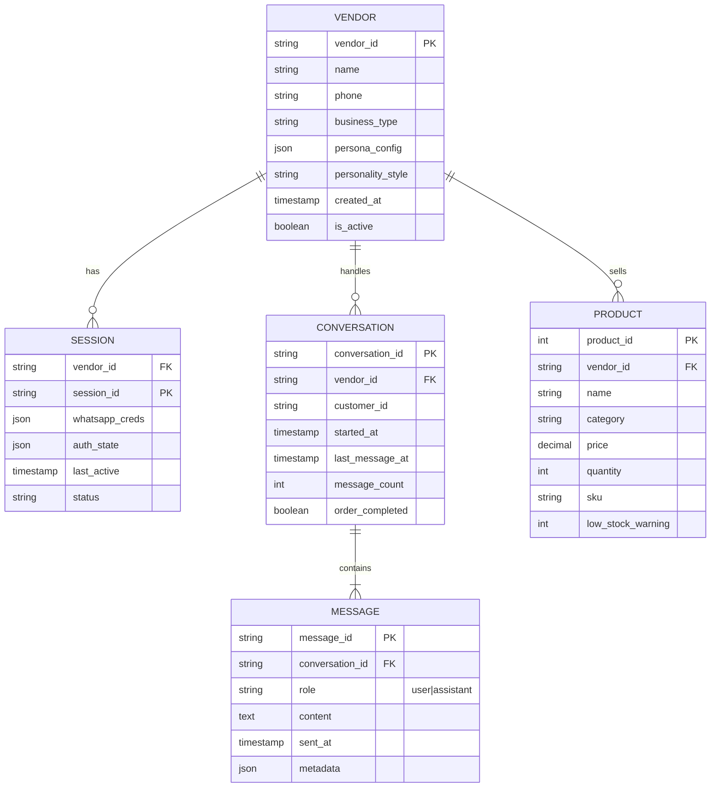
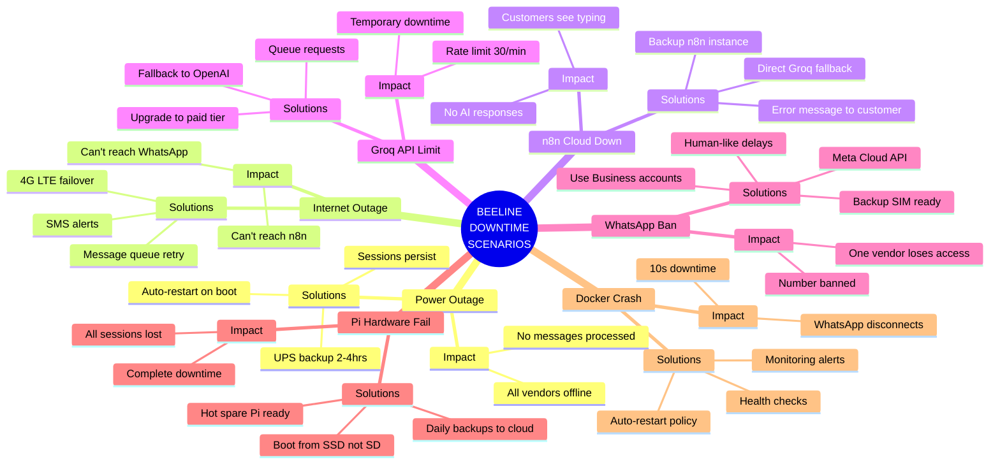
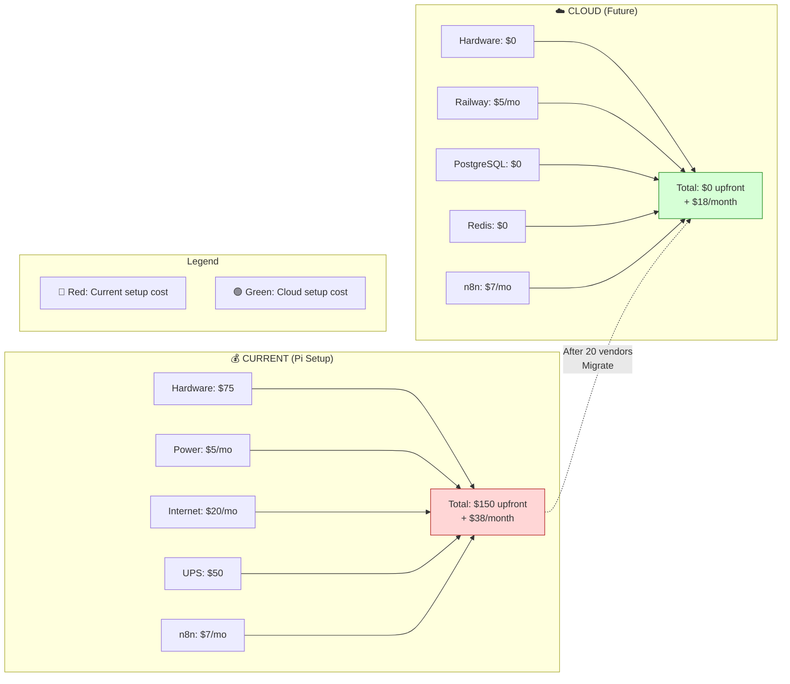
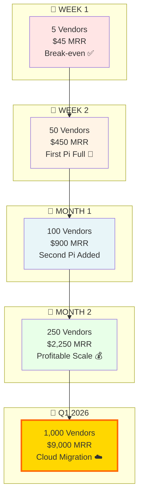
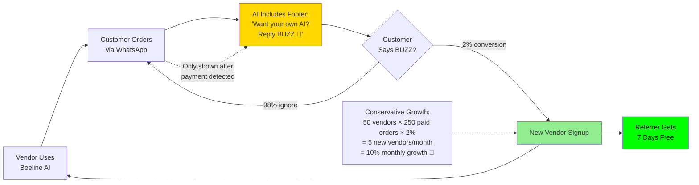
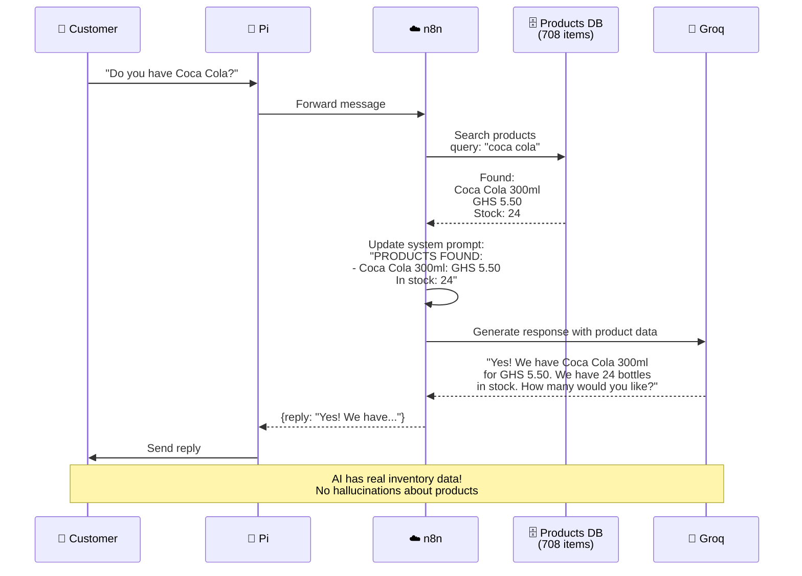
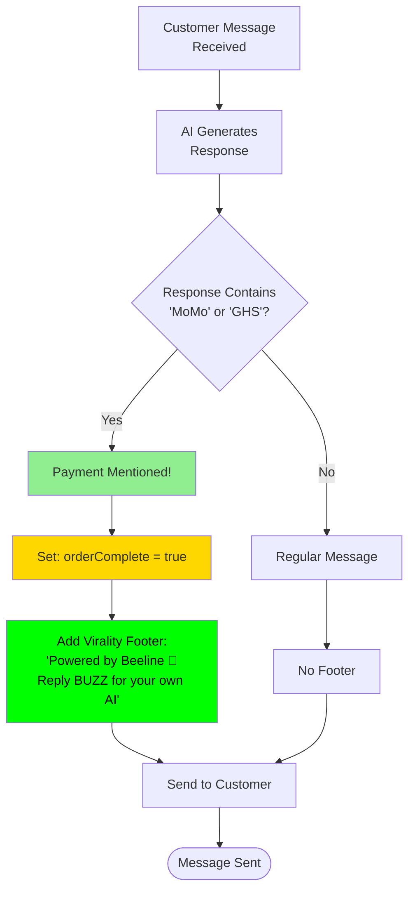

# BEELINE GHANA - VISUAL DIAGRAMS & SCHEMAS

This document contains all visual diagrams in Mermaid format. You can render these as images using:
- GitHub (auto-renders in README)
- Mermaid Live Editor: https://mermaid.live
- VS Code with Mermaid extension
- Export to PNG/SVG/PDF

---

## 1. CURRENT SYSTEM ARCHITECTURE



---

## 2. FUTURE CLOUD ARCHITECTURE

```mermaid
graph TB
    subgraph Onboarding["🆕 VENDOR ONBOARDING"]
        A1[Web UI: beeline.works/signup]
        A2[Vendor Scans QR in Browser]
        A3[Session → PostgreSQL]
    end

    subgraph CloudBridge["☁️ CLOUD BRIDGE<br/>(Railway/Render)"]
        B1[Docker: beeline-bridge]
        %% Baileys is a WhatsApp Web API library for Node.js
        B2[Baileys Multi-Session<br/>1000+ Capacity]
        B3[PostgreSQL Session Storage]
        B4[Redis Conversation Cache]
    end

        C1[AI Processing (Same as Web UI)]
        C1[AI Processing Same as Current]
    end

    subgraph Backup["🔄 FAILOVER (Optional)"]
        D1[Raspberry Pi Home Backup]
        %% D2 monitors the cloud health and automatically takes over operations if the cloud service is down, ensuring seamless failover.
        D2[Monitors Cloud Health Takes Over if Down]
    end

    A1 --> A2
    A2 --> A3
    A3 --> B3

    B1 --> B2
    B2 --> B3
    B2 --> B4

    B2 -->|HTTPS| C1
    C1 -->|Reply| B2

    C1 -.->|If Cloud Fails| D1
    D1 -.->|Backup Connection| B3

    style CloudBridge fill:#E8F5F8,stroke:#0066CC,stroke-width:3px
    style Backup fill:#FFF4E6,stroke:#FFA500,stroke-dasharray: 5 5
    style Onboarding fill:#E8FFE8,stroke:#00AA00
```

---

## 3. MESSAGE FLOW SEQUENCE



---

## 4. DATA MODEL SCHEMA



---

## 5. VENDOR ONBOARDING FLOW

```mermaid
flowchart TD
    Start([Vendor Visits<br/>beeline.works]) --> Form[Fill Sign-Up Form<br/>Name, Phone, Business]
    Form --> Voice[Record Voice Note:<br/>'What do you sell?']
    Voice --> Upload[Upload to n8n]

    Upload --> STT[Groq STT:<br/>Transcribe Audio]
    STT --> AI[Groq AI:<br/>Generate Persona]

    AI --> Persona{Persona Generated}
    Persona --> Style[Show 3 Styles:<br/>Casual | Formal | Twi-heavy]

    Style --> Pick[Vendor Picks Style]
    Pick --> Save[Save to PostgreSQL]

    Save --> QR[Generate QR Code]
    QR --> Display[Display QR in Browser]

    Display --> Scan{Vendor Scans<br/>with WhatsApp?}
    Scan -->|Yes| Connected[✅ Connected!<br/>AI Employee Live]
    Scan -->|No| Wait[Wait for Scan...]
    Wait --> Scan

    Connected --> End([Vendor Dashboard])

    style Start fill:#90EE90
    style Connected fill:#00FF00,color:#000
    style End fill:#FFD700
    style Scan fill:#FFA500
```

---

## 6. DOWNTIME SCENARIOS MIND MAP



---

## 7. COST BREAKDOWN COMPARISON



---

## 8. GROWTH PROJECTIONS



---

## 9. VIRALITY LOOP



---

## 10. PRODUCT INTEGRATION FLOW



---

## 11. PAYMENT DETECTION LOGIC



---

## HOW TO USE THESE DIAGRAMS

### 1. **View in GitHub**
Just push this file to your repo - GitHub auto-renders Mermaid diagrams.

### 2. **Export as Images**
- Copy any diagram
- Go to https://mermaid.live
- Paste code
- Click "Actions" → "Export PNG/SVG/PDF"

### 3. **Use in Presentations**
- Export as PNG with transparent background
- Insert into PowerPoint/Google Slides
- Professional diagrams ready!

### 4. **Interactive Diagrams**
- Use Mermaid Live Editor for presentations
- Click nodes to highlight relationships
- Zoom in/out for details

---

**Created:** December 2, 2025
**For:** Beeline Ghana Platform
**By:** Claude Code + Joshua
